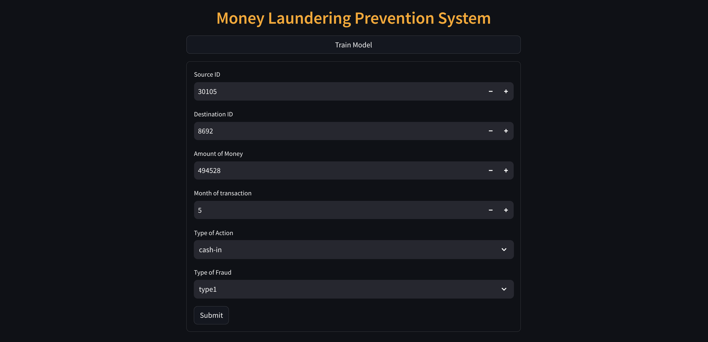

"# Money-Laudering-ml-project" 
"# mlproject1" 


**🔗 Deployed Website on Streamlit Cloud Link** [](https://ineuron-money-laundering-1a.streamlit.app/)

This project aims to predict the likelihood of backorders for products in a supply chain using machine learning techniques.  
Backorders occurs when a product is temporarily out of stock, and customers need to wait for it to become available again. By predicting potential backorders of a product, businesses can proactively manage their inventory and improve customer satisfaction.

### Screenshots of UI



### Project demo video

https://github.com/githubvishal1234/mlproject1/assets/ml1

### Usage

1. Install required packages.

```sh
pip install -r requirements.txt
```

2. Run the streamlit web application.

```sh
streamlit run app.py
```

3. After running above command a web page opens in your browser.  
   Otherwise, Go to your browser and search the below url in address bar.

```
http://localhost:8501/
```

### Techs

- Git & GitHub
- Python3.11
- Streamlit
- MongoDB
- Data Science libraries like pandas, numpy, matplotlib, seaborn, etc.

### Features

- Predict the backorders in one click. I made the web app using streamlit which is a easy to easy tool to build a web app using python only.
- You can see the dataset analysis in Jupyter Notebook [here](./notebooks).